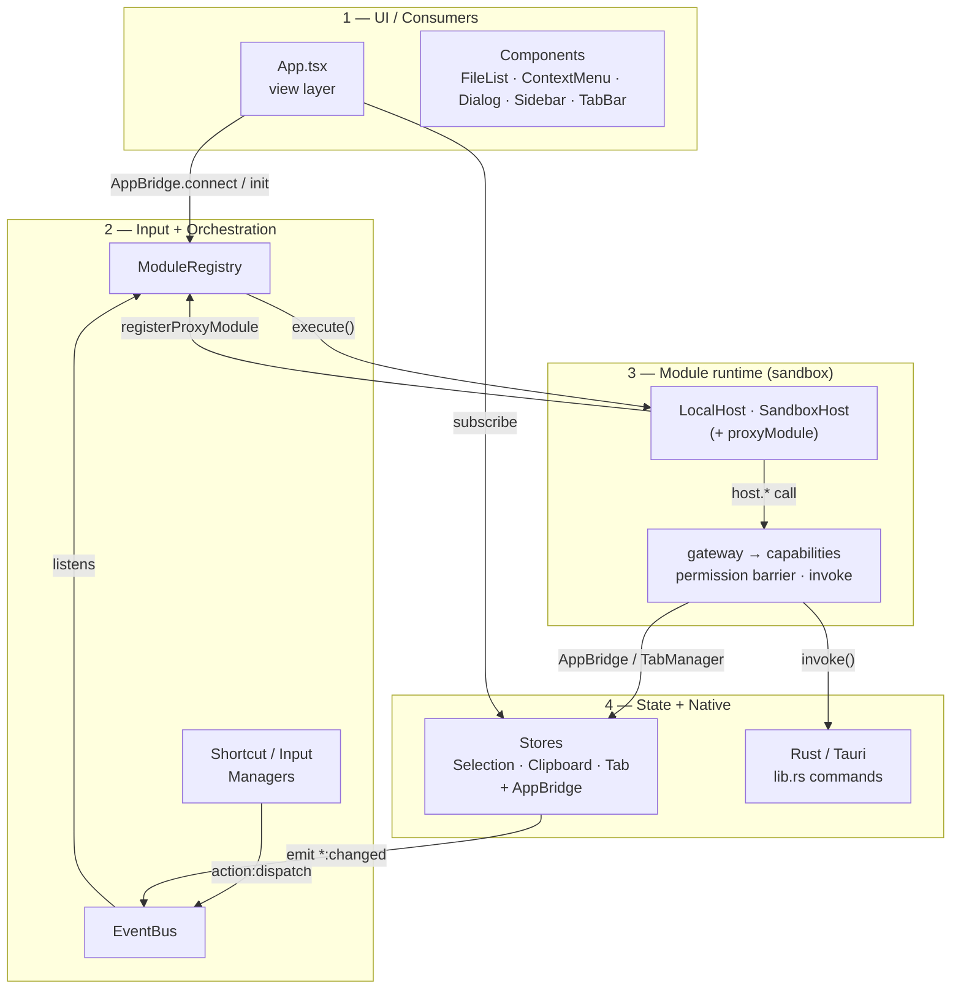
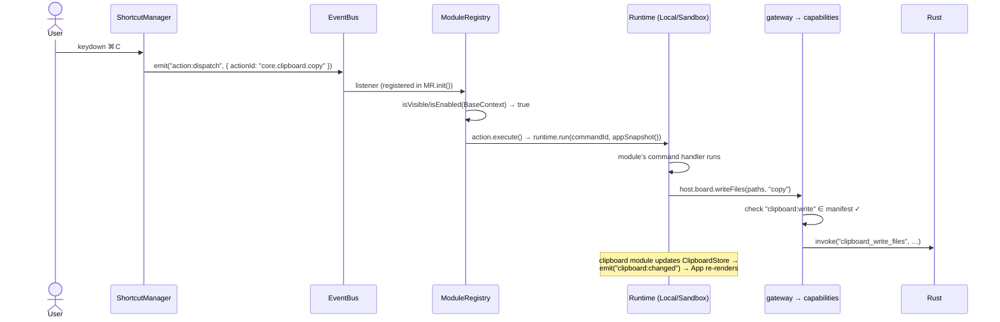
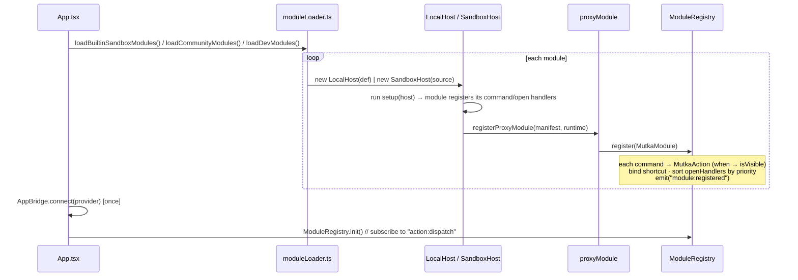

# Mutka — Architecture

> Keep this document in sync whenever you change the core layer, the module
> runtime, or the data flow.
> View Mermaid diagrams with the VS Code extension [Markdown Preview Mermaid Support](https://marketplace.visualstudio.com/items?itemName=bierner.markdown-mermaid) or at [mermaid.live](https://mermaid.live)

---

## The big idea: one module format, two runtimes, one gateway

A module is a plain ESM file that `export default defineModule({ id, name, version,
permissions, commands, openHandlers, setup })`. **Authors import nothing from the
core.** In `setup(host)` they receive a `host` object — their ONLY path to the
system. Every privileged `host.*` call is checked against the module's declared
`permissions` by a single barrier, **the gateway**.

The same module code runs in either of two runtimes; only the transport differs:

- **`LocalHost`** (`core/sandbox/LocalHost.ts`) — trusted built-ins, **in-process**.
  Direct calls, no Worker, no serialization.
- **`SandboxHost`** (`core/sandbox/SandboxHost.ts`) — untrusted community modules,
  **isolated in a Web Worker** (`core/sandbox/sandbox.worker.ts`). No DOM, no
  `invoke`, no reference to the core; reaches the system only via postMessage RPC.

```text
   ┌─────────────── one module format: defineModule({...}) ───────────────┐
   │  built-in / trusted                          community / untrusted    │
   ▼                                              ▼                        │
 ┌────────────────────────────┐   ┌────────────────────────────────────────┐
 │ LocalHost (in-process)     │   │ SandboxHost                            │
 │ direct calls               │   │  ╔═══ Web Worker — isolation boundary ═╗│
 │                            │   │  ║ no DOM · no invoke · no core ref     ║│
 │                            │   │  ║ source imported from a blob URL      ║│
 │                            │   │  ║ system only via postMessage host-call║│
 │                            │   │  ╚══════════════════════════════════════╝│
 └─────────────┬──────────────┘   └────────────────────┬───────────────────┘
               │                                        │
               └──────────► dispatchCapability() ◄──────┘
                            ════════════════════
                            THE GATEWAY  (core/sandbox/gateway.ts)
                            required permission ∈ manifest.permissions ? run : throw
                                        │
                                        ▼
                   capabilities.ts — the ONLY code touching
                   invoke() · AppBridge · TabManager
                        │             │              │
                        ▼             ▼              ▼
                 Rust commands   App React state   TabManager
                  (invoke)        (AppBridge)
```

A worker module that did not declare a permission cannot use the capability — and
because it has no `invoke` at all, the denial is *physical*, not merely a check.

---

## Layers

Layers stack top-to-bottom.



### Relation matrix

Read as **row → column**: "the row component does X to the column component."

| from ↓ \ to → | App | Registry | EventBus | Runtime | Gateway | Stores | Rust |
| --- | :-: | :-: | :-: | :-: | :-: | :-: | :-: |
| **App** | — | init / resolveOpen | subscribe / emit | — | AppBridge.connect | set / read | — |
| **Registry** | — | — | on(dispatch) / emit | execute / runOpen | — | read (visibility) | — |
| **EventBus** | notify | notify | — | forward (whitelist) | — | — | — |
| **Runtime** | — | registerProxyModule | on (whitelist) | — | dispatchCapability | — | — |
| **Gateway** | — | — | — | — | — | update (via bridge) | invoke |
| **Stores** | — | — | emit | — | — | — | — |
| **Rust** | — | — | — | — | — | — | — |

Key reads of the matrix:

- **Gateway → capabilities** is the only row with a cell under **Rust** — the sole
  `invoke()` caller. Modules never reach Rust directly.
- **Runtime → Gateway** is the single chokepoint: every module capability call passes
  through `dispatchCapability`, which checks the permission first.
- **App → Stores** is the one privileged direct read (trusted UI, no module identity).
- **App.tsx imports no modules.** The three `moduleLoader` functions discover them.

---

## Read-only view context

There is exactly one context type, and modules never act through it.

```typescript
interface BaseContext {
  selectedItems: FileItem[];    // from SelectionStore
  currentDirectory: string;     // from AppBridge (TabManager / App.tsx)
  clipboard: ClipboardState;    // from ClipboardStore
  navigation: NavigationAPI;    // canGoBack, canGoForward, etc.
}
```

`BaseContext` is read-only and exists only for visibility/enablement checks:
`isVisible(ctx)`, `isEnabled(ctx)`, and the `ContextMenu` component. It carries no
`fs`, `board`, `dialog`, or `refresh` — those are capabilities, reached only through
the `host` inside a running command. `ModuleRegistry` builds `BaseContext` itself
(via `SelectionStore`, `ClipboardStore`, `AppBridge`); it is not passed in.

Command visibility for sandboxed modules is **declarative**: a serializable
`when` clause (because a predicate can't cross the worker boundary) that the host
evaluates via `core/sandbox/whenClause.ts`.

| `when.selection` | true when |
| --- | --- |
| `any` | always |
| `none` / `some` | nothing / one-or-more selected |
| `single` / `multiple` | exactly one / two-or-more |
| `singleDir` / `singleFile` | exactly one, dir / file |
| `files` / `dirs` | one-or-more, all files / all dirs |

`when.clipboard: "hasItems"` additionally gates on a non-empty clipboard (for Paste).

---

## Permission enforcement

```text
host.fs.deleteItem(path)            (inside a command handler)
  → gateway.dispatchCapability(manifest, "fs", "deleteItem", [path])
  → look up capabilities.fs.deleteItem → requires "fs:write"
  → manifest.permissions.includes("fs:write") ?
        YES → invoke("delete_item", { path })
        NO  → throw "Permission denied: fs.deleteItem requires fs:write …"
              → caught by the runtime / ModuleRegistry, logged, "error:action" emitted
```

`capabilities.ts` is the **entire** vocabulary of what any module can do. If an
operation is not listed there, no module can perform it. It is also the only file
that touches `invoke`, `AppBridge`, or `TabManager`.

| Capability | Permission | Backed by |
| --- | --- | --- |
| `fs.readDir`, `fs.openItem` | `fs:read` | Rust `read_dir` / `open_item` |
| `fs.copyFiles`/`moveFiles`/`deleteItem`/`renameItem`/`createFile`/`createFolder` | `fs:write` | Rust FS commands |
| `board.readFiles` / `board.writeFiles` | `clipboard:read` / `clipboard:write` | Rust pasteboard commands |
| `nav.navigate`/`goBack`/`goForward`/`goUp` | `navigation` | AppBridge |
| `tabs.openTab`/`openTabInBackground`/`isActive` | `navigation` | TabManager |
| `dialog.prompt`/`confirm` | `dialog` | AppBridge |
| `app.refresh` (`host.refresh()`) | `fs:read` | AppBridge |
| `home.get` / `home.set` | `fs:read` / `view` | HomeStore (app home dir; overridable) |
| `settings.toggle` | `view` | SettingsStore (settings overlay) |
| `sys.homeDir` | `fs:read` | Rust `get_home_dir` (OS home) |
| `sys.lastDir` | `fs:read` | localStorage (last visited dir) |
| `sys.writeTempFile` | `fs:temp` | Rust `write_temp_file` (weaker than `fs:write`) |

`ModulePermission`: `fs:read`, `fs:write`, `fs:temp`, `clipboard:read`, `clipboard:write`,
`navigation`, `view`, `dialog`, `network`, `storage`, `secrets`, `shell` (`shell` reserved —
unused today). `fs:temp` writes only to the OS temp dir, so it is weaker than `fs:write`.

---

## Data flow: keyboard shortcut → command



For a worker module the `host.board.writeFiles` call is a postMessage host-call;
`SandboxHost` runs `dispatchCapability` and posts the result back. The handler code
is identical to the in-process case.

---

## Data flow: module registration



Built-in open handlers (priority 0) register first, so a community module can claim
an item type with a higher priority.

---

## Store singletons

| Owner | File | Emits | Consumed by |
| --- | --- | --- | --- |
| `SelectionStore` | `core/stores/SelectionStore.ts` | `selection:changed` | App.tsx render; appSnapshot |
| `ClipboardStore` | `core/stores/ClipboardStore.ts` | `clipboard:changed` | App.tsx render; appSnapshot |
| `TabManager` | `core/tab-manager/TabManager.ts` | `tabs:changed`, `tabs:last-closed` | App.tsx, TabBar; tabs capability |

These are the canonical state owners. App.tsx React state is a derived mirror used
only for triggering re-renders.

---

## What App.tsx still provides

App.tsx is intentionally thin but still owns React-resident state that a few
capabilities need. It exposes it once via `AppBridge.connect(...)`:

- **Navigation API** — `navigateTo`, `goBack`, `goForward`, `goUp`, `canGoBack`,
  `canGoForward` (backs the `nav` / `tabs` capabilities)
- **Dialog API** — `prompt()` / `confirm()` backed by the `<Dialog>` component
  (backs the `dialog` capability)
- **`refresh()`** — re-reads the current directory (backs `app.refresh`)
- **File list** — `files[]`, re-read via `read_dir` on directory change

A stable ref keeps the provider current, so capabilities always reach the latest
state without reconnecting on every render.
