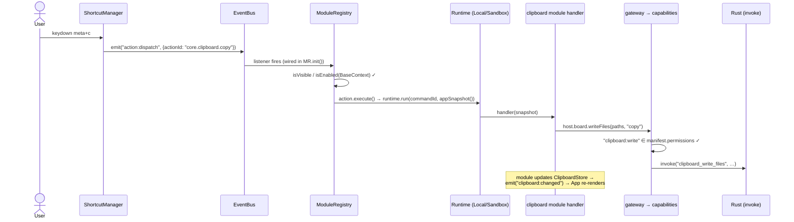
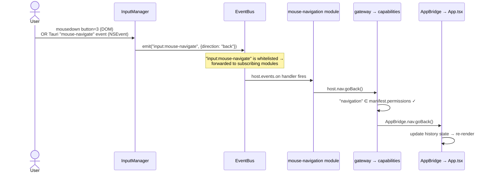
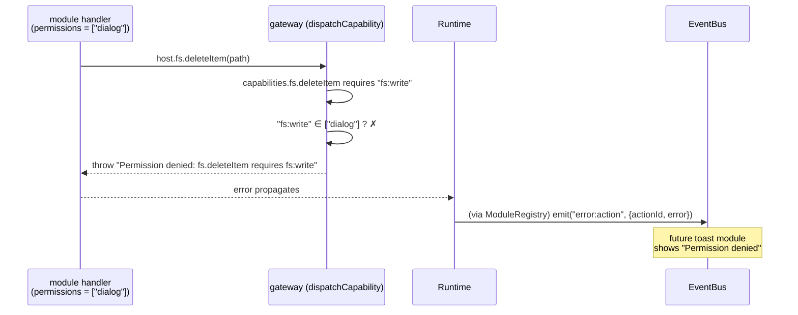
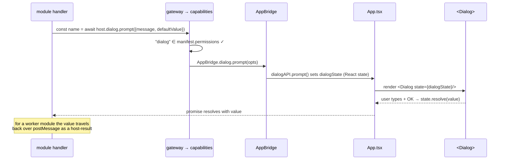

# Runtime Flows

> **Keep these diagrams in sync with the code.**
> Update when you change how input reaches `ModuleRegistry`, how commands are dispatched, how the gateway enforces permissions, or how community modules are loaded and isolated.
> View with the VS Code extension [Markdown Preview Mermaid Support](https://marketplace.visualstudio.com/items?itemName=bierner.markdown-mermaid) or at [mermaid.live](https://mermaid.live).

The recurring shape: **input → ModuleRegistry → runtime → gateway → capability.**
Built-in and community modules follow the identical path; only the runtime's
transport differs (direct call vs. Web Worker postMessage).

---

## Flow 1 — Keyboard shortcut / command (e.g. ⌘C)



`appSnapshot()` is a serializable `{ selectedItems, currentDirectory, clipboard }`
captured at dispatch time, so a worker handler sees state without touching the DOM.

---

## Flow 2 — Mouse back/forward buttons

Two hardware paths converge on one EventBus event, which a built-in module reacts to.



Only events in `core/sandbox/eventWhitelist.ts` reach modules — `SUBSCRIBABLE_EVENTS`
(e.g. `input:mouse-navigate`, `file:modifier-open`) with their payload, and
`NOTIFY_ONLY_EVENTS` (`clipboard:changed`, `tabs:changed`) as a bare
ping with the payload stripped. Everything else is denied at `host.events.on`.

---

## Flow 3 — Permission denied (at the gateway)

What happens when a module calls a capability whose permission it did not declare.



For a **worker** module the picture is stronger: `host.fs.deleteItem` is a
postMessage host-call, and `SandboxHost.handleCall` runs the same `dispatchCapability`
check before any `invoke` — and the worker has no `invoke` of its own to fall back on.

---

## Flow 4 — Community module load (isolation boundary)

How an untrusted module gets into an isolated Web Worker and becomes usable.

```mermaid
sequenceDiagram
    participant MM as ModuleManager (descriptors.ts)
    participant Rust
    participant SH as SandboxHost
    participant W as Web Worker (sandbox.worker.ts)
    participant PM as proxyModule
    participant MR as ModuleRegistry

    MM->>Rust: invoke("list_user_modules") → invoke("read_module_file", path)
    Rust-->>MM: module source string
    MM->>SH: new SandboxHost(source)  // when enabled; disabled → probeManifest only
    SH->>W: spawn worker; postMessage {t:"load", source}
    W->>W: import source from a blob URL
    W->>SH: {t:"ready", manifest}   // permissions known before any host-call
    W->>W: run setup(host) — registers commands / open handlers / subscriptions
    SH->>PM: registerProxyModule(manifest, runtime)
    PM->>MR: register(MutkaModule)
    Note over MR: menu items, when clicked, post {t:"run"} to the worker;<br/>every host-call is gated by dispatchCapability
```

The worker has no DOM, no `invoke`, and no reference to the core. Its only window on
the world is postMessage, and `protocol.ts` defines every shape allowed to cross it.

`loadDevModules()` (DEV only) loads repo `dev-modules/*/index.js` as `?raw` source
through this exact same path, so the isolated runtime is testable without installing
anything into `~/.mutka/modules/`.

---

## Flow 5 — Dialog round-trip



---

## Flow 6 — Double-click open resolution

```mermaid
sequenceDiagram
    actor User
    participant FL as FileList
    participant MR as ModuleRegistry
    participant RT as Runtime
    participant GW as gateway → capabilities

    User->>FL: double-click item
    FL->>MR: resolveOpen(item)
    MR->>MR: first openHandler (priority desc) whose matches(item) ✓
    MR->>RT: runtime.runOpen(handlerId, item)
    RT->>GW: folder → host.nav.navigate(path)<br/>file → host.fs.openItem(path)
    Note over MR: default core.navigation is priority 0;<br/>a community module can override at a higher priority
```

---

## The one rule that ties it all together

```text
User input
  ↓  Core captures it — ShortcutManager / InputManager
EventBus "action:dispatch" → ModuleRegistry.executeAction(actionId)
  ↓  isVisible / isEnabled checked against BaseContext (no capabilities)
  ↓  runtime.run(commandId, appSnapshot())  — in-process OR in a Web Worker
Module handler runs
  ↓  reaches the system ONLY through host.* capabilities
  ↓  each host.* call → gateway.dispatchCapability → permission check
  ↓        declared?  yes → capabilities.ts runs it (invoke / AppBridge / TabManager)
  ↓                   no  → throws → caught + logged + "error:action" emitted
  ↓  side effects (stores updated) → EventBus "*:changed"
App.tsx listeners update React state → re-render
```

**`invoke()`** is called only by `core/sandbox/capabilities.ts` — never by modules, and
no longer by the UI (`App.tsx` reaches Rust only through capabilities, via modules).

**Modules declare permissions once** (`permissions: ["fs:write", "clipboard:write"]`)
and every capability call is enforced against that list at the gateway.

**Built-in vs. community** changes only the runtime (LocalHost vs. SandboxHost) — the
module code, the gateway, and `proxyModule` are identical.
